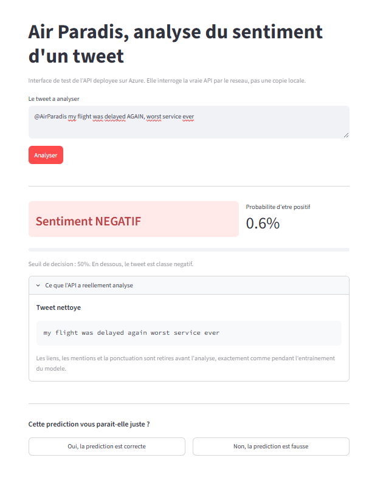
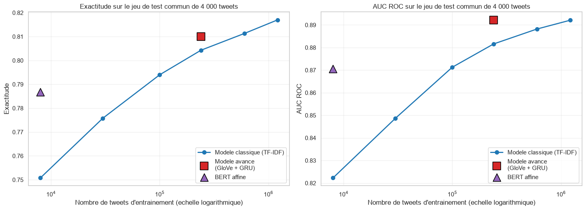
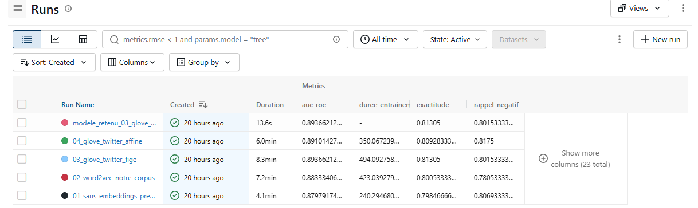
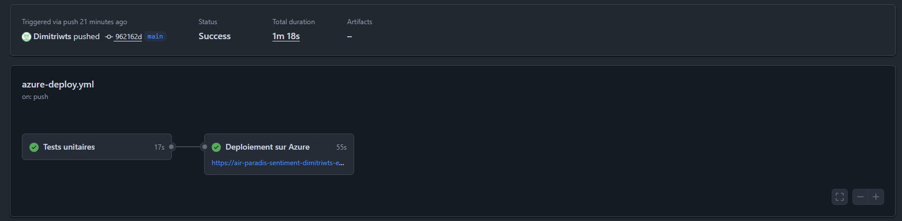
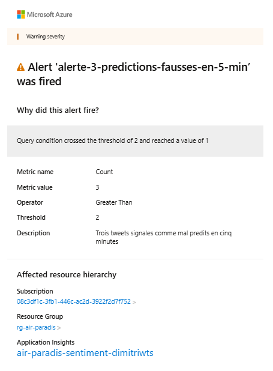

# Détecter un bad buzz avant qu'il ne parte : ce que trois modèles d'IA nous ont appris

*Comment nous avons construit, comparé et mis en production un modèle d'analyse
de sentiment pour une compagnie aérienne, et pourquoi le modèle le plus
sophistiqué n'est pas toujours celui qu'on croit.*

---

Une compagnie aérienne nous a posé une question simple : peut-on savoir, à la
lecture d'un tweet, s'il exprime un mécontentement ? L'enjeu est évident pour
elle. Un message négatif repéré dans l'heure se traite ; le même message repéré
trois jours plus tard est devenu une crise.

Nous avons construit ce prototype, comparé trois approches d'intelligence
artificielle, et mis la meilleure en production sur le cloud. Voici ce que nous
avons trouvé, y compris ce à quoi nous ne nous attendions pas.

*L'interface de test interroge l'API deployee sur Azure et demande a l'utilisateur de valider la prediction.*

## Le point de départ : 1,6 million de tweets

Notre cliente ne disposait d'aucune donnée exploitable sur le sujet. Nous
sommes donc partis d'un jeu de données public, Sentiment140 : 1,6 million de
tweets en anglais, étiquetés positifs ou négatifs.

Sa particularité mérite d'être signalée, car elle fixe une limite à tout ce qui
suit. L'étiquetage a été fait automatiquement : un tweet contenant une émoticône
souriante a été classé positif, un tweet avec une émoticône triste, négatif. Les
émoticônes ont ensuite été retirées du texte. C'est ingénieux, mais imparfait :
un message ironique accompagné d'un smiley se retrouve étiqueté positif à tort.
Aucun modèle ne pourra faire mieux que la qualité de ce qu'on lui donne à
apprendre.

Premier travail, donc : nettoyer. Nous retirons les liens et les mentions
d'utilisateurs, qui n'apportent rien au sentiment mais gonflent démesurément le
vocabulaire puisque chaque lien est unique, puis la ponctuation et les lettres
répétées.

Une décision compte plus que toutes les autres. La plupart des outils proposent
une liste de « mots vides » à supprimer, ces mots trop courants pour porter du
sens. Or ces listes toutes faites contiennent les négations. Si l'on retire
*not* de *« this flight was not good »*, il reste *« flight good »*, et le sens
est inversé. Nous avons donc construit une liste expurgée, et écrit un test
automatique qui échoue si quelqu'un y réintroduit un jour une négation.

Nous avons aussi retiré 5 % de doublons, apparus après nettoyage : messages
banals et spam publicitaire republié jusqu'à 1 500 fois. Les garder aurait
placé un même tweet des deux côtés du partage entre entraînement et test, et
gonflé nos scores sans raison.

## Trois approches, de la plus simple à la plus sophistiquée

### 1. Le modèle classique : compter les mots

La première approche transforme chaque tweet en un décompte de mots pondérés,
selon une méthode appelée TF-IDF. Le principe tient en une phrase : un mot est
important s'il est fréquent dans ce tweet-ci, mais rare dans l'ensemble des
tweets. Le mot *the* apparaît partout, il ne distingue rien ; le mot *terrible*
est rare, donc très informatif. Une régression logistique apprend ensuite un
poids par mot.

Sa faiblesse est structurelle : elle ignore complètement l'ordre des mots. Pour
elle, *« not good »* et *« good not »* sont la même chose.

Une correction partielle existe, les paires de mots : *« not good »* devient
alors un terme à part entière. Nous avons mesuré ce qu'elle apporte, et au
passage un résultat contre-intuitif. **Retirer les mots vides fait perdre 1,4
point de performance** quand on utilise les paires. Rétrospectivement c'est
logique : les paires ont besoin de ces mots pour exister. Supprimer *not* avant
de former *« not good »* détruit précisément l'information qu'on cherchait.

Résultat : **82,2 % d'exactitude**, entraîné en 54 secondes sur 1,2 million de
tweets.

### 2. Le modèle sur mesure avancé : lire la phrase dans l'ordre

La deuxième approche combine deux idées.

D'abord les *word embeddings*, ou plongements lexicaux. Au lieu de dire « le mot
*terrible* porte le numéro 4271 », on lui associe une liste de 200 nombres qui
capture son sens. Deux mots de sens voisin reçoivent des listes voisines, ce qui
permet au modèle de généraliser de *awful* à *terrible* même s'il a peu vu le
second.

Ensuite un réseau de neurones récurrent, qui lit le tweet mot après mot en
gardant une mémoire de ce qu'il a déjà lu. C'est ce qui lui permet de comprendre
qu'un *not* placé au début modifie un *good* qui arrive trois mots plus loin.

Nous avons comparé deux sources d'embeddings, comme demandé par le cahier des
charges. D'un côté des vecteurs appris sur nos propres tweets. De l'autre GloVe,
publié par l'université Stanford et entraîné sur **2 milliards de tweets**.

GloVe l'emporte de 1,26 point, et l'on peut voir pourquoi plutôt que se
contenter du score. Voici les mots que chaque méthode juge les plus proches de
*delayed* :

| Appris sur nos 240 000 tweets | GloVe, 2 milliards de tweets |
|---|---|
| yesterdays, boarding, closing, **postponed**, council, rapid | **delay, postponed, delays, cancelled, canceled, scheduled** |

Un mot pertinent sur six d'un côté, six sur six de l'autre. Avec 240 000 tweets,
on n'a tout simplement pas assez d'exemples pour apprendre le sens d'un mot.

Résultat : **81,3 % d'exactitude** sur 240 000 tweets.

### 3. BERT : comprendre le contexte

La troisième approche utilise BERT, un modèle de langue publié par Google. Les
embeddings classiques donnent un seul vecteur par mot, quel que soit son
contexte : dans *« the room is light »* et *« this bag is light »*, le mot
*light* a la même représentation. BERT en produit une différente à chaque
occurrence, calculée en fonction de tous les autres mots de la phrase.

Nous avons testé deux stratégies. La première consiste à utiliser BERT tel quel,
sans le modifier. Résultat surprenant : **76,9 %**, soit le plus mauvais score de
tout le projet. Une régression logistique bat un modèle de 66 millions de
paramètres.

Ce n'est pas une anomalie. BERT a été pré-entraîné à deviner des mots masqués
dans des phrases, pas à résumer un texte. Sans adaptation, c'est un moteur
puissant mais débrayé. La seconde stratégie, l'affinage, consiste justement à
modifier ses poids pour notre tâche : on passe alors à **79,9 %**, mais pour un
coût de calcul sept fois supérieur.

## Le piège de la comparaison naïve

À ce stade, le classement semble clair, et il est embarrassant :

| Approche | Exactitude | Tweets vus |
|---|---|---|
| Classique | 82,2 % | 1 214 000 |
| Avancé | 81,3 % | 240 000 |
| BERT | 79,9 % | 8 000 |

Plus le modèle est sophistiqué, moins il est performant. On pourrait en conclure
que l'IA moderne ne sert à rien.

Ce serait une erreur de lecture. Regardez la dernière colonne : **il y a un
facteur 150** entre le premier et le dernier. Nos modèles avancés sont lourds à
entraîner et nous les avons nourris avec beaucoup moins de données. Nous ne
comparions pas trois modèles, nous comparions trois quantités de données.

Nous avons donc refait la comparaison proprement. D'abord en construisant un jeu
de test commun de 4 000 tweets **qu'aucun des trois modèles n'avait jamais vus à
l'entraînement**. Ensuite en traçant la courbe d'apprentissage du modèle
classique : quelle performance obtient-il selon la quantité de données dont il
dispose ?

| Tweets d'entraînement | Exactitude du modèle classique |
|---|---|
| 8 000 | 75,1 % |
| 30 000 | 77,6 % |
| 100 000 | 79,4 % |
| 240 000 | 80,4 % |
| 1 214 000 | 81,7 % |

Il suffit alors de placer les autres modèles sur cette courbe, à la quantité de
données qu'ils ont réellement vue :

| Modèle | Tweets | Son score | Le classique au même volume | Écart |
|---|---|---|---|---|
| Modèle avancé | 240 000 | 81,0 % | 80,4 % | **+0,6 point** |
| BERT affiné | 8 000 | 78,7 % | 75,1 % | **+3,6 points** |

**Les deux modèles avancés gagnent.** Le classement initial était entièrement un
artefact de la quantité de données.

Et l'écart grandit à mesure que les données se raréfient, ce qui est la
signature du transfert d'apprentissage : un modèle pré-entraîné apporte une
connaissance de la langue qui compense le manque d'exemples. C'est précisément
ce qui rend BERT intéressant quand on ne dispose que de quelques milliers
d'exemples étiquetés, situation la plus fréquente en entreprise.

*Un point au-dessus de la courbe signifie que le modele fait mieux qu'une regression logistique disposant des memes donnees.*

## Ce que les scores ne disent pas

Un pourcentage global cache les cas particuliers. Or pour notre cliente, un cas
particulier compte plus que les autres : la négation. Voici ce que donnent des
paires de phrases identiques à un mot près.

| Phrase | Modèle avancé | BERT |
|---|---|---|
| this flight was good | 0,941 | 0,972 |
| this flight was **not** good | **0,032** | **0,027** |
| the crew was helpful | 0,949 | 0,974 |
| the crew was **never** helpful | 0,624 ❌ | **0,052** ✅ |
| i would recommend it | 0,952 | 0,969 |
| i would **not** recommend it | **0,209** ✅ | 0,776 ❌ |

Les deux modèles gèrent la négation, ce dont le modèle classique était
incapable par construction. Mais ils n'ont pas les mêmes angles morts : chacun
réussit là où l'autre échoue. Un écart d'un demi-point d'exactitude ne dit rien
de cela.

## La démarche MLOps : sortir du notebook

Un modèle qui fonctionne dans un notebook ne vaut rien tant qu'il n'est pas en
production. Le MLOps désigne l'ensemble des pratiques qui font ce pont.

**Tracer les expérimentations.** Nous avons enregistré chacun des 14
entraînements avec MLflow : ses réglages, ses scores, sa durée. Sans cela, au
bout de quinze essais, personne ne sait plus quelle configuration avait donné le
meilleur résultat.

**Centraliser les modèles.** Les trois modèles retenus sont versés dans un
catalogue versionné, avec la description de ce qu'ils attendent en entrée. À
tout moment on peut remonter du modèle en production aux paramètres exacts de
son entraînement.

*Chaque entrainement est enregistre avec ses reglages, ses scores et sa duree.*

**Versionner le code.** Tout est dans un dépôt Git, avec des messages de commit
qui expliquent les décisions et pas seulement les changements.

**Tester automatiquement.** Le projet compte 48 tests. Le plus important vérifie
que le nettoyage du texte est **rigoureusement identique** entre l'entraînement
et la production. Si les deux divergent, le modèle reçoit en ligne un texte
différent de celui qu'il a appris à lire, et se dégrade sans qu'aucune erreur ne
s'affiche. C'est un piège classique, appelé *training/serving skew*, et notre
test le rend impossible.

**Déployer en continu.** Chaque envoi de code déclenche les tests, puis le
déploiement **si et seulement s'ils passent tous**. Personne ne peut mettre en
ligne une version cassée, même par inadvertance.

*Le deploiement n'a lieu que si les 48 tests passent.*

## Ce qui casse entre le notebook et la production

Trois obstacles réels, qu'aucun tutoriel ne mentionne.

Le serveur gratuit choisi est limité à 1 Go de mémoire, quand TensorFlow en pèse
600 à la seule installation. Nous avons converti le modèle au format
TensorFlow Lite : **de plusieurs centaines de mégaoctets à 4,2 Mo**, pour une
prédiction en 0,16 milliseconde. La conversion a refusé de fonctionner du
premier coup, et il a fallu reconstruire le réseau avec deux options
particulières, sans perdre un point de performance.

L'enregistrement d'un modèle est resté bloqué 46 minutes sans message d'erreur :
la bibliothèque avait changé son format de sauvegarde pour un format plus sûr,
mais qui parcourt l'objet élément par élément. Avec 300 000 termes de
vocabulaire, cela ne se terminait jamais.

Enfin, un entraînement est passé de 65 à 941 secondes par cycle sans qu'une
ligne de code ait changé. La cause n'était pas le modèle mais la mémoire : la
machine saturée écrivait sur le disque. Un chargement de données trop gourmand
a été corrigé, ramenant l'occupation de 1 068 Mo à 45 Mo.

Ces trois incidents ont un point commun : **aucun ne provoque d'erreur
visible**. Le système continue de fonctionner, simplement mal. C'est exactement
ce que la démarche MLOps cherche à rendre détectable.

## Surveiller le modèle une fois en ligne

Un modèle se dégrade avec le temps. Le langage évolue, les sujets changent, et
les tweets d'aujourd'hui ne ressemblent plus à ceux sur lesquels il a appris. On
appelle cela la dérive, et son danger est qu'elle ne se voit pas : le modèle
continue de répondre avec assurance, simplement il se trompe plus souvent.

Notre interface demande donc à l'utilisateur, après chaque prédiction, si elle
lui paraît juste. Quand il répond non, une trace part vers Azure Application
Insights avec le tweet, la réponse du modèle, et surtout **l'écart au seuil de
décision**. Ce dernier champ distingue un modèle qui se trompe en hésitant, ce
qui est acceptable, d'un modèle qui se trompe avec aplomb, ce qui l'est beaucoup
moins.

Une règle d'alerte prévient par courriel dès que trois prédictions sont
contestées en cinq minutes.

*L'alerte se declenche des que trois predictions sont contestees en cinq minutes.*

Nous avons d'ailleurs découvert un défaut en conditions réelles : la première
version envoyait **cinq courriels pour un seul incident**, parce que la règle
réévaluait la même fenêtre de temps chaque minute. Corrigé en rendant l'alerte
persistante. C'est un problème connu, la fatigue d'alerte : un système qui crie
trop finit par ne plus être écouté.

## Et ensuite : améliorer le modèle dans le temps

Les traces collectées ne servent pas seulement à alerter. Elles constituent la
matière première d'un cycle d'amélioration continue.

À court terme, elles permettent d'analyser les erreurs : sur quels types de
tweets le modèle se trompe-t-il ? Les messages courts, l'ironie, un vocabulaire
récent ? Un tableau de bord suivant le taux de contestation semaine après
semaine rendrait la dérive visible avant qu'elle ne devienne un problème.

À moyen terme, les tweets signalés forment un jeu de données précieux : ce sont
exactement les cas difficiles. Les faire étiqueter, puis les ajouter aux données
d'entraînement, corrige le modèle là où il échoue vraiment plutôt que de le
renforcer là où il réussit déjà.

À plus long terme, le réentraînement peut devenir automatique : dès que
suffisamment de nouveaux exemples ont été collectés, un modèle candidat est
entraîné, comparé au modèle en place sur un jeu de test figé, et déployé
seulement s'il fait mieux. Toute l'infrastructure nécessaire, le suivi des
expérimentations, le catalogue de modèles, les tests et le déploiement
automatique, est déjà en place.

## Ce que nous en retenons

Le modèle le plus sophistiqué n'est pas toujours le meilleur choix, mais ce
n'est jamais l'exactitude seule qui tranche. Notre modèle avancé l'emporte à
données égales, comprend les négations, et se sert en 0,16 milliseconde pour
4 Mo. BERT fait mieux encore quand les données étiquetées sont rares, mais
demande une infrastructure que ce prototype ne justifiait pas.

Et surtout : une bonne partie du travail se joue après la modélisation. Nous
avons passé autant de temps à faire sortir le modèle du notebook qu'à le
construire, et c'est là que se trouvent les vraies difficultés.

---

*Article rédigé par Dimitri Wyts, ingénieur IA chez MIC (Marketing Intelligence
Consulting).*
